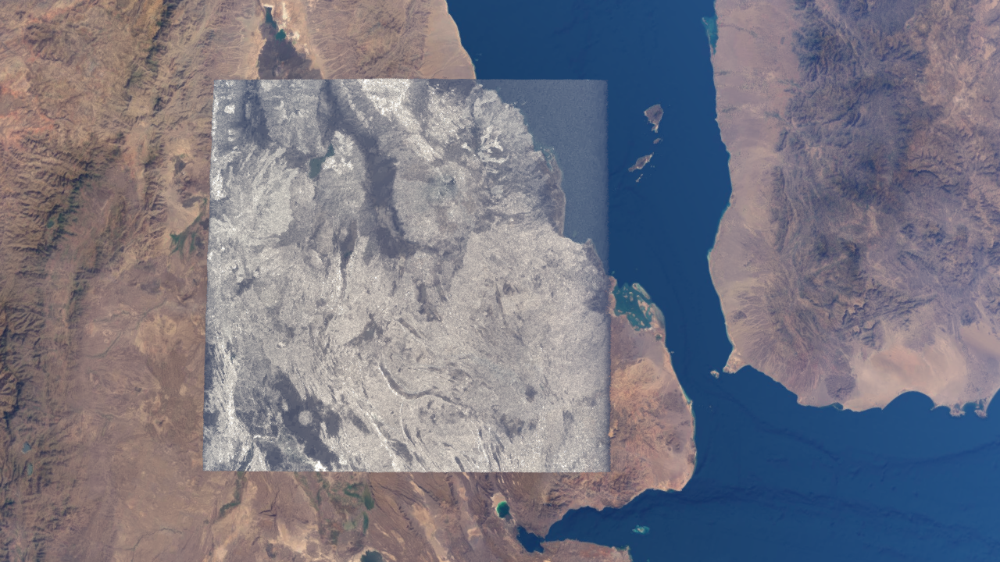
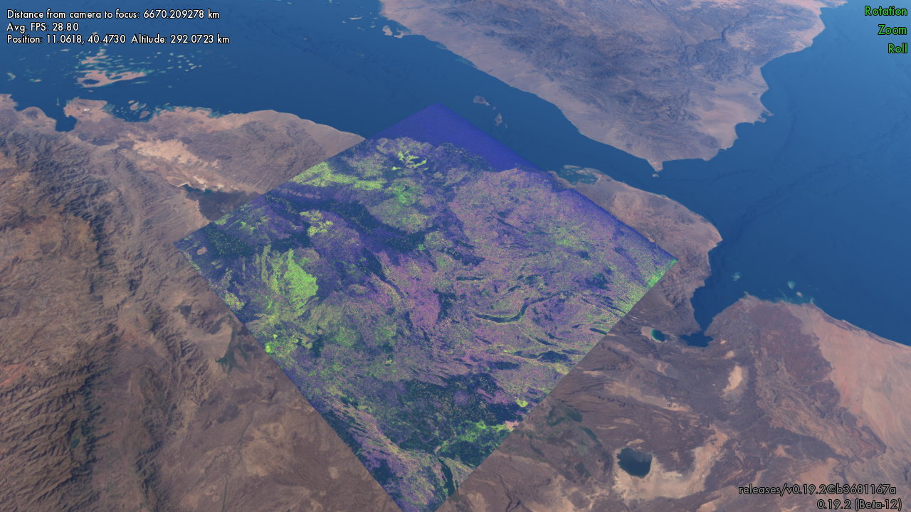
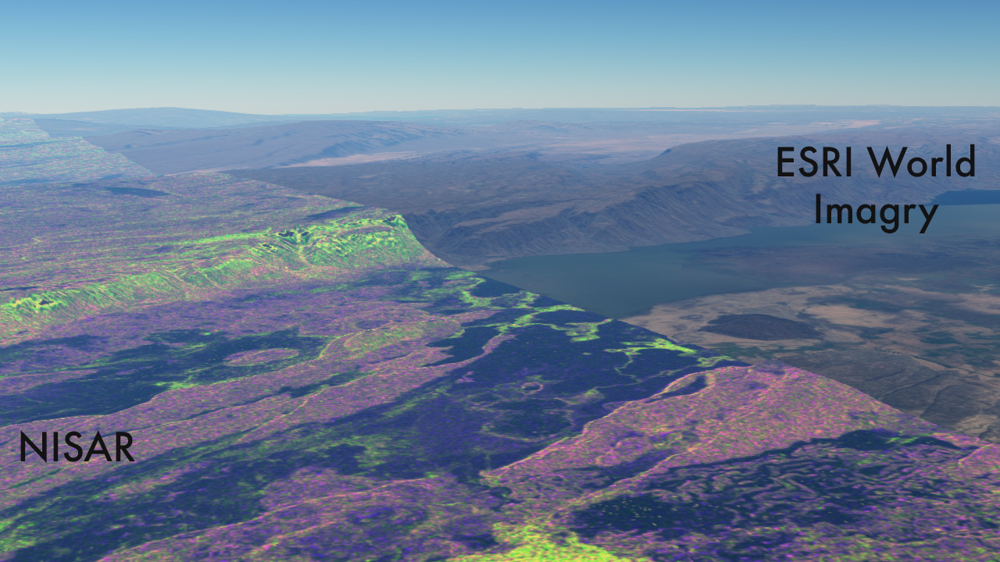

# nisar-into-planetarium
Quick steps to bring NISAR data into the planetarium software


starting with h5 GCOV file which was downloaded from here:

[asf.alaska.edu](https://search.asf.alaska.edu/#/?dataset=NISAR&prodConfig=PR&resultsLoaded=true&granule=NISAR_L2_PR_GCOV_006_172_A_008_2005_DHDH_A_20251204T024618_20251204T024653_X05007_N_F_J_001&zoom=7.673&center=41.485,10.631)

or 

[earthdata.nasa.gov](https://search.earthdata.nasa.gov/search/granules?p=C3622214170-ASF&pg[0][v]=f&pg[0][gsk]=-start_date&q=nisar&lat=12.598643340155649&long=42.916701638649215&zoom=7.065471754872718)


pull out HHHH sub group:

```gdal_translate -of NetCDF  NETCDF:"NISAR_L2_PR_GCOV_006_172_A_008_2005_DHDH_A_20251204T024618_20251204T024653_X05007_N_F_J_001.h5"://science/LSAR/GCOV/grids/frequencyA/HHHH hh.h5```

Make a single band geotiff from that:

```gdalwarp -of GTiff -t_srs EPSG:4326 NETCDF:hh.h5 nisar-hh.tiff```

This could be shown in grayscale:




To show more normal polarimetry data: we would do the same for HV component:

Replace:

```//science/LSAR/GCOV/grids/frequencyA/HVHV```

in the above gdal. 

Then I used python to make a new tiff that had the red channel as HH, the green channel as HV, and the blue as HH/HV. This is where you would have the option to change the scaling of the different color ranges depending on how you want it. I didn't make any informed decisions about the color scaling for these images. Saved that as an rgb tiff with data type 8 Byte: 

```gdalinfo nisar-rgb.uint8.tif```

```
...
Band 1 Block=17394x1 Type=Byte, ColorInterp=Red
  NoData Value=0
Band 2 Block=17394x1 Type=Byte, ColorInterp=Green
  NoData Value=0
Band 3 Block=17394x1 Type=Byte, ColorInterp=Blue
  NoData Value=0
...
```

Then make a vrt using the following

```gdalbuildvrt nisar-rgb.vrt -te -180 -90 180 90 -addalpha nisar-rgb.uint8.tif```

(and need to add

```<NODATA>0</NODATA>```

into the `<ComplexSource>` tag for the alpha band.)
Then I can load that vrt directly into the [OpenSpace](https://www.openspaceproject.com) application. 

The example VRT is available in this repository. 







## References:

https://www.earthdata.nasa.gov/learn/tutorials/work-nisar-sample-data

https://docs.openspaceproject.com/latest/building-content/globebrowsing/creation/build-local-dem-patches.html
